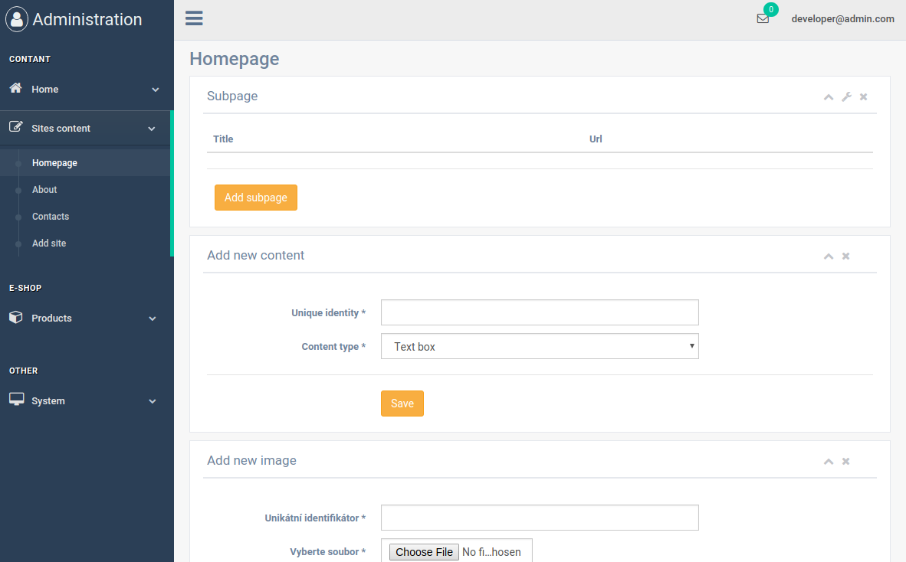

# CMS Spring Boot [](https://travis-ci.com/buttasam/cms-boot)
CMS based on [Spring Boot](https://spring.io/projects/spring-boot). 

The aim is to create relative small, flexible and extendable content management system based pure on Spring Boot and SQL database.

It is an alternative to complex solutions such as Liferay, which are quite hard to understand.

## Architecture

It is classical MVC application, so everyone can understand it very easy and quicky.

It uses awesome [Spring JPA](https://spring.io/guides/gs/accessing-data-jpa/) to manipulate entities.

## Quickstart

1) Clone repository
2) Go to project folder `cd cms-boot`
3) Build project `./gradlew build`
4) Run project `java -jar build/libs/cms-boot-0.2-SNAPSHOT.jar --spring.profiles.active=dev`
5) Run it on `localhost:8080`

Better way of usage is to create local database. Create file *application-local.yml* from *application-local.yml.template* and run it in local profile.

### Login
You can login as admin or developer on: `/login` 
- `admin@admin.com / admin`
- `developer@admin.com / admin`


### Usage

As a developer you can in administration add page texts and page images.




As a administrator you can edit this page texts and images.

Insert data to templates in controllers calling method `addPageData` for example HomapageController.java:

```
    @RequestMapping("/")
    public String index(Model model) {
        addPageData(model, "homepage");

        return "front/index";
    }
```

In templates you maps *pageTexts* and *pageImages*. You have an access to data. For example in *about.html*. 

```
    <div class="row">
        <div class="col-lg-12 text-center">
            <h1 class="mt-5">About us</h1>
            <p th:utext="${pageTexts.get('about-text')}"></p>

            <image th:src="@{/file/} + ${pageImages.get('about-image')}"></image>

        </div>
    </div>
```


### IDEA Config

We recommand you to use IntelliJ IDEA.

#### Profile

Dev profile can be actived. In that case application-dev.yml is used and datasource
is h2 db. To do in idea go to 
 
`Run/Debug Configuration > Active Profiles > Insert "dev"`  

#### Lombok

Lombok is present and should be used in every entity. To run it smoothly in IDEA install Lombok plugin and 
turn on annotation processors in settings.
``
